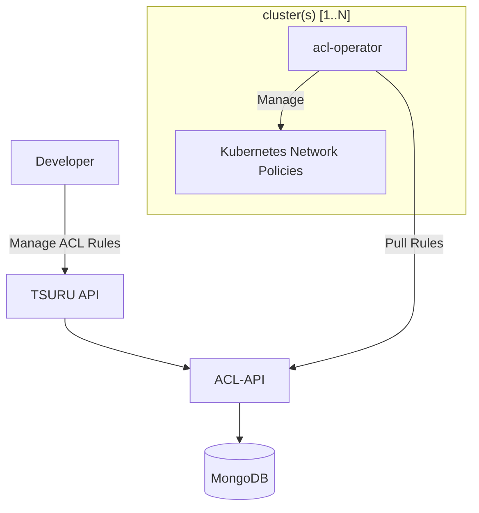

# acl-controller
Control network access in high abstractions by Tsuru Applications 

# Architecture

```mermaid
graph TD;
    developer[Developer];
    tsuru[TSURU API];
    aclapi[ACL-API];
    mongodb[(MongoDB)];
    acl-operator[acl-operator];
    network-policies[Kubernetes Network Policies]

    developer -- Manage ACL Rules --> tsuru;
    tsuru --> aclapi;
    aclapi --> mongodb;
    acl-operator -- Pull Rules ----> aclapi

    click tsuru "https://www.github.com/tsuru/tsuru" "Access github project"
    click aclapi "https://www.github.com/tsuru/acl-api" "Access github project"

    click acl-operator "https://www.github.com/tsuru/acl-operator" "Access github project"
    click network-policies "https://kubernetes.io/docs/concepts/services-networking/network-policies/" "Read more about kubernetes network policies"

    subgraph "cluster(s) [1..N]"
      acl-operator -- Manage --> network-policies
    end
```
